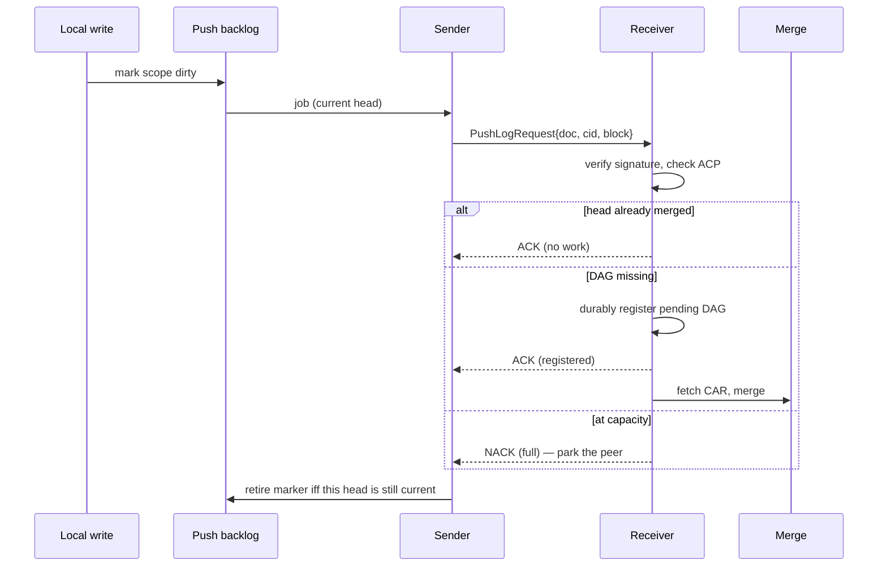
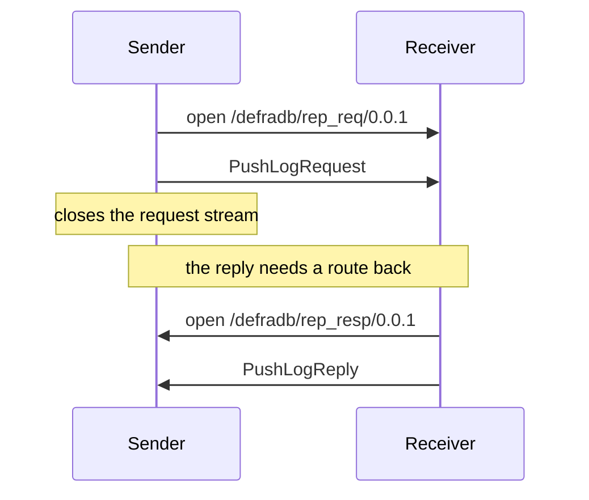
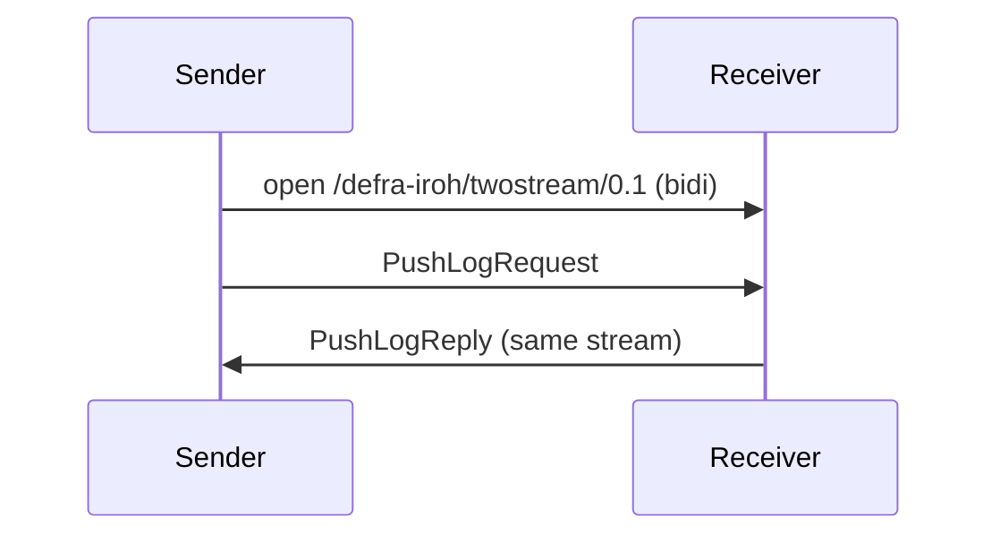
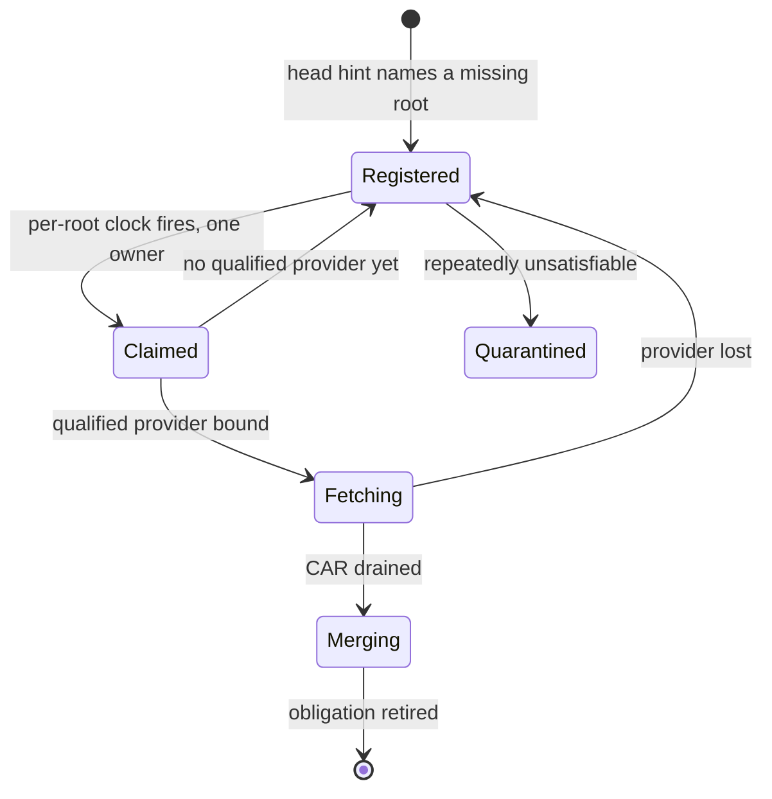

# p2p

P2P networking for defradb.rs: two transports behind one trait, and the sync
coordinator that drives them.

`P2PTransport` (`src/transport.rs`) is the seam. The coordinator is generic over
it and never names a transport. Two implementations exist:

| Transport | Feature | Wire | Talks to |
|---|---|---|---|
| libp2p | `libp2p-transport` | gossipsub + libp2p-stream, protocol ids `/defradb/<op>/0.0.1` | Go DefraDB and Rust |
| iroh | `iroh-transport` | QUIC, ALPN `/defra-iroh/mux/0.1`, stream tags `/defra-iroh/<op>/0.1` | Rust only |

Both are opt-in: `default = []`.

## The head hint

A write produces a block. The pusher announces the new head to each replicator
and the receiver decides whether it needs the DAG behind it. The announcement
carries one current head, is idempotent, and the sender holds only a marker —
on retry it *rederives* the current head rather than replaying a stored one.

The `iff` on the last line is load-bearing. A newer head may have been written
while the attempt was in flight, so retiring the marker unconditionally drops
an obligation for a head that never reached the wire. Both completion paths in
`sync/coordinator/push_worker.rs` are guarded by `backlog.is_current(job)`.

## Where the reply goes

This is the one place the two transports genuinely differ, and it is a property
of the **transport**, not of the peer — `P2PTransport::prefers_same_stream_reply`.

**libp2p** keeps Go's shape. The sender opens a request stream, sends, and
closes it; the receiver dials *back* on a separate response protocol. This
cannot change: Go verifies signatures by re-serializing the request, so any
field it does not recognise breaks verification.

**iroh** answers on the request's own QUIC bidirectional stream, via the
response token (`ResponseToken = iroh::endpoint::SendStream`).

The consequence is not cosmetic. A relay-only path authenticates the origin but
gives no reverse route, so under the libp2p shape the head can merge while the
ACK never arrives and the sender retries forever. Under iroh it cannot: the
reply rides a stream that already exists. Both are model-checked —
`proofs/tla/MC_Transport_Red_RelayNoRouteBack.cfg` and
`MC_Transport_Green_SameStream.cfg` differ in that setting alone.

## A send that returns `Ok` has not been delivered

Every `send_*` on the trait is fire-and-forget; the reply arrives later as a
separate inbound event. `handle_send_two_stream_request` waits 30s and then
returns `Err(Transport("timeout waiting for response"))`. That error **cannot**
distinguish a request that never arrived from one that was delivered, processed,
and whose reply was lost. Callers must treat a timeout as *maybe delivered* and
leave the retry obligation in place.

## Recovering a missing DAG

The receiver owns every fetch. One owner per root, bounded in flight, and the
provider must be reachable, authenticated, hold the complete linked DAG, and be
willing to serve this receiver.

A gossip relay can hold the head block without holding its descendants, so
possession of the announced block is not evidence a peer can serve the DAG.

## Stream inventory

libp2p uses paired request/response protocol ids; iroh uses stream tags
multiplexed over one ALPN. The two are not one-to-one: on libp2p the head hint,
doc sync and branchable sync all share `rep_req`/`rep_resp` and are told apart
by message shape, while iroh gives each its own tag. Every iroh operation except
`twostream` and `pushlog` still pairs a `/req` with a `/resp` tag.

| Operation | libp2p | iroh |
|---|---|---|
| Head hint (replicator, acked) | `rep_req` / `rep_resp` | `twostream/0.1` (reply on the same stream) |
| Head hint (broadcast) | gossipsub topic | iroh-gossip topic |
| Head hint (direct stream) | — | `pushlog/0.1` |
| Doc sync | `rep_req` / `rep_resp` (shared) | `docsync/0.1` + `/resp` |
| Branchable sync | `rep_req` / `rep_resp` (shared) | `branchable/0.1` + `/resp` |
| CAR fetch | `car_req` / `car_resp` | `car/0.1` + `/resp` |
| Identity | `ident_req` / `ident_resp` | `identity/0.1` |
| SE artifacts | `rep_se_req` / `rep_se_resp` | `se/0.1` |
| SE query | `se_query_req` / `se_query_resp` | `se-query/0.1/req` + `/resp` |
| Management | `manage_req` / `manage_resp` | `manage/0.1/req` + `/resp` |
| Management query | `manage_query_req` / `manage_query_resp` | `manage-query/0.1/req` + `/resp` |

## Scheduling

Inbound events share one bounded scheduler with four classes
(`sync/event_dispatcher.rs`): `Inline`, `Admission`, `Recovery`, `Completion`.
The enum is exhaustive over both event types, so adding a variant fails to
compile until its class is chosen. Cross-class starvation over a single link is
not currently modelled.

## Formal models

`proofs/tla/` carries the protocol properties this crate is expected to hold:

| Model | Covers |
|---|---|
| `Transport` | the link itself: reorder, multipath duplication, reply shape, ambiguous timeout |
| `SyncOwnership` | who owns a fetch, provider qualification, single-flight |
| `PushCoalescing` | latest-head retirement, no stale retry |
| `PushBacklog` | bounded outbound queue, permit conservation |
| `PushLogAdmission` | a success ACK means registered-or-merged |
| `PendingDagQuarantine` | unsatisfiable DAGs are quarantined, not dropped |
| `Replicator` | backfill, live delivery, resume across restart |
| `Convergence` / `DagReplication` | ancestry walk before merge |

Each has a `*_DESIGN.md` next to it anchoring the abstraction to modules in this
crate. `proofs/README.md` records what is bound to the running binary and what
is an assumed boundary.
