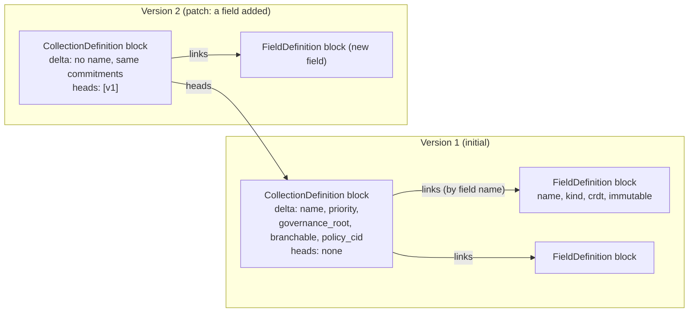
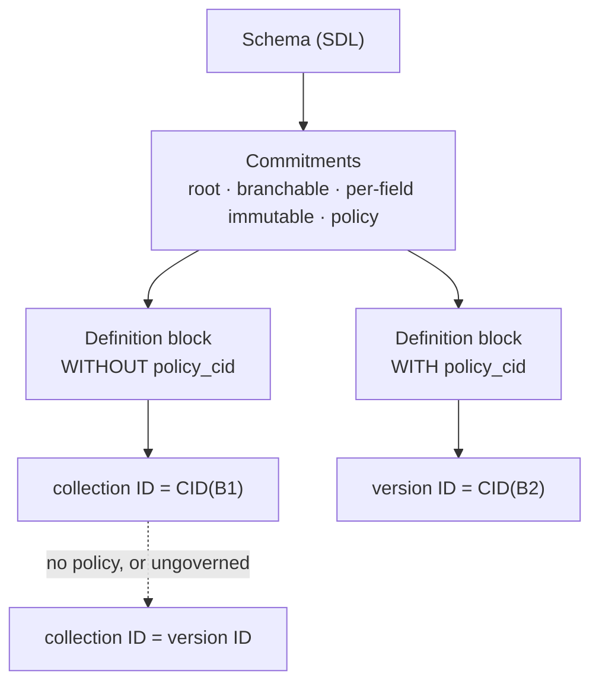
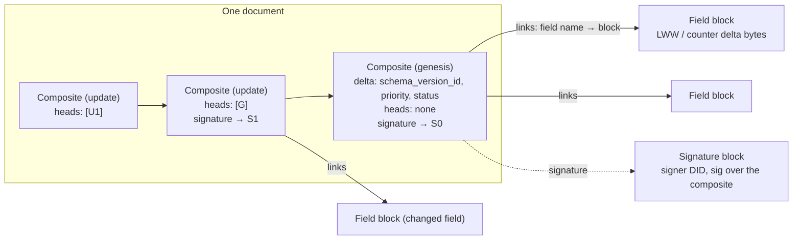
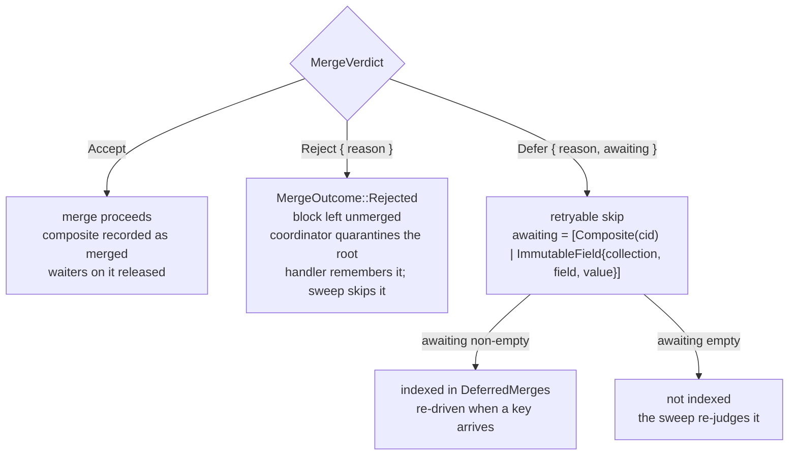
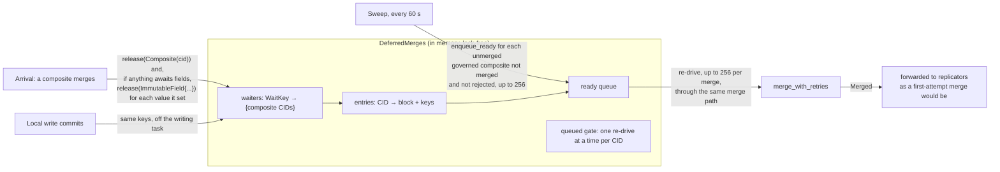
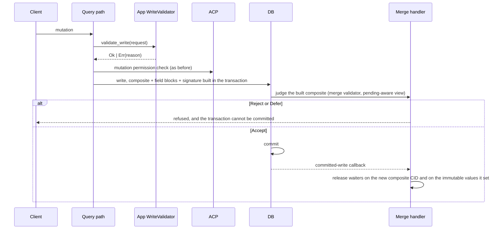
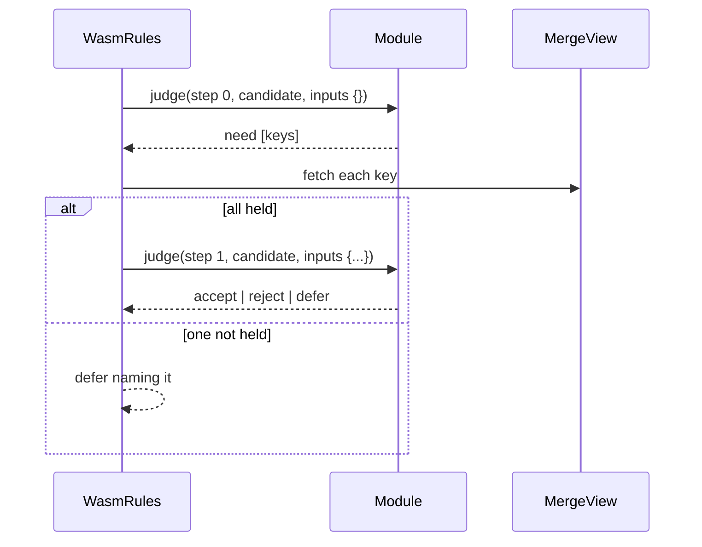

# Governed collections

What a governed collection is, what its DAGs hold, and what happens to a
block on its way in. Written for someone integrating an application against
the access-control interface (PR #1826) or reviewing it, who knows DefraDB's
block model but not this layer.

Everything here is anchored to the code at the commit the document ships
with. Where a mechanism lives in a follow-on PR rather than this one, the
text says so.

---

## 1. In one paragraph

A collection becomes *governed* when its schema declares a governance root:
`type T @governed(root: "<SAID>") { ... }`. That does two things. Its
**identity** commits to what governs it: the root, each field's `@immutable`
flag and `@branchable` enter the collection ID, and the policy enters the
version ID, so a node that does not know the root is not a replica of the
collection at all. And its **replicated writes are judged**: every composite
that arrives over the network passes through an application-supplied merge
validator that reads only content-addressed inputs and answers *accept*,
*reject*, or *defer until X is held*. Two honest replicas holding the same
bytes reach the same verdict; a replica missing an input waits for it rather
than guessing. Local writes are judged by the same application on the query
path before a block exists. Nothing changes for a collection without a root.

---

## 2. The two DAGs

A governed collection is described by one DAG and populated by many.

### 2.1 The definition DAG: what the collection *is*

One block per version, linked to the version it patches. The version ID is
the block's CID.



What the delta carries depends on whether the collection is governed. Every
governance field is serialised only when set, so an ungoverned definition
produces exactly the bytes it did before any of this existed, and the same
CID (`crates/defra-core/src/block_delta.rs`, the `skip_serializing_if`
attributes; pinned by `ungoverned_identities_are_pinned` in
`crates/query/src/sdl_parse/identity_tests.rs`).

| Delta field | Ungoverned | Governed |
|---|---|---|
| `name`, `priority`, view query | as before | as before |
| `governance_root` | absent | the root |
| `is_branchable` | absent | present when true |
| per-field `immutable` (in the field block) | absent | present when true |
| `policy_cid` | absent | a CID over the policy reference, when a policy is attached |
| `rule` | absent | the tag of the rule this version is judged by, from `@governed(rule:)` |

### 2.2 Identity: two CIDs over one block



- **Collection ID** answers "which collection is this". It commits to the
  root, immutability and branchability **of the initial definition**. Two
  nodes that disagree about any of those derive different collection IDs
  and are not replicas of each other (`crates/schema/src/cid.rs`,
  `Commitments`). A patch inherits the collection ID from the version it
  supersedes, even when it adds a field marked `@immutable`: the patch's
  version ID commits to the new field, its collection ID does not, so the
  collection ID cannot be used to detect what a patch changed.
- **Version ID** answers "which revision of it". It additionally commits to
  the policy, so attaching or changing a policy mints a new version of the
  *same* collection. That is the "model-and-revision pair" of the ACP2 design:
  a collection is bound to a policy revision, and a revision change is an
  explicit upgrade recorded in the DAG as a new definition block.
- The policy commitment is a CID over the policy's id and resource name. Under
  the local ACP backend the id is itself a hash of the policy's content, and a
  policy is never edited in place, so the reference pins the ruleset. (The
  local id also folds in a per-node counter, so the same policy text added on
  two nodes can carry two ids; under SourceHub the id comes from the chain.)
- **The rule tag** is a version commitment like the policy. The identity
  otherwise commits to who governs and not to which validator runs, so two
  nodes could agree on a revision and judge under different code;
  `@governed(rule: "<tag>")` puts the rule in the version ID, so a rule
  change is a recorded upgrade and a node judging under another rule is
  visibly on a different version. A name today, a content identifier for
  the rule's code later; a validator should refuse a definition naming a
  rule it does not recognise.
- The block a receiving node rebuilds the identity from is the block itself,
  so a peer derives the same IDs the author did
  (`a_definition_block_reproduces_its_identity_on_a_fresh_node`).

### 2.3 The document DAGs: what the collection *holds*

One DAG per document. A composite block names the version it was written
under, links its field blocks, points at the composite(s) it follows, and
carries a signature block.



Field blocks are content-addressed bytes; an encrypted field links an
encryption block instead of plain bytes. The `schema_version_id` in the
composite is the version ID above, so **every write names the policy
revision it was made under**, by construction.

---

## 3. What judges a write, and what it may read

### 3.1 The validator and its inputs

An application installs a `MergeGovernance`: the collection names it claims,
and a `MergeValidator` (`crates/db/src/merge/governance/validator.rs`). For
each replicated composite of a claimed collection the merge handler builds a
`MergeCandidate`:

| Field | What it is |
|---|---|
| `cid`, `block`, `payload` | the composite as held |
| `doc_id`, `collection` | the document and the collection version the block names |
| `is_genesis` | no heads |
| `signature` | `Verified(did)`, `Invalid`, `Unsigned`, or `NotHeld(cid)` when the signature block is missing |

The signature is verified by the handler from the block itself, so a
composite reached through crash recovery, where dispatch skips verification,
is judged the same way as one that arrived over the wire.

The validator reads through a `MergeView` (`view.rs`). Every read is either
addressed by content or scoped to one snapshot taken for the verdict:

| Read | Answers | Replica-independent because |
|---|---|---|
| `block(cid)` | a block by CID | content-addressed |
| `composite_fields(cid)` | the fields a composite links, each `Value`, `Encrypted`, `NotHeld(cid)` or `Undecodable` | content-addressed |
| `genesis(cid)` | the genesis composite reached by first heads, or `None` if an ancestor is missing | content-addressed walk |
| `find_documents(collection, field, value)` | ids of documents whose `@immutable` scalar field equals `value`, deleted ones included, sorted by id | an immutable field is set once, so a match is stable; deletion does not unset it |
| `immutable_fields(collection, doc_id)` | the `@immutable` scalar fields of one merged document | same |

What is deliberately **not** offered: the current value of a mutable field,
any wall clock, the node's identity, the sending peer, ACP registration
state. Any of those would let two honest replicas reach different verdicts.
The one obligation on validator authors follows from the lookups: an empty
or partial result means "not replicated here yet", so a verdict may depend on
the *presence* of a matching document, never on the absence of one.

### 3.2 The three verdicts



- **Accept** is terminal: the composite merges and is never re-judged.
- **Reject** is terminal and rests on present bytes: no arrival can change
  it. The block stays in the blockstore unmerged. The p2p coordinator
  quarantines the pending-DAG root so its own retry clock stops; the merge
  handler records the CID so the governance sweep leaves it alone.
- **Defer** names what the verdict is waiting for. That is the contract's
  answer to "a replica cannot tell *never* from *not yet*": it neither drops
  the write nor accepts it, and it says what would settle it.

An update whose ancestor is not held cannot even be attributed to a document.
In a governed collection that is treated as a defer on the first missing
ancestor rather than as an error (`judge.rs`, `defer_unresolved_document`).

### 3.3 The sequence for a replicated composite

```mermaid
sequenceDiagram
  participant P as Peer
  participant C as p2p coordinator
  participant H as Merge handler
  participant J as Judge
  participant Val as App validator
  participant BS as Blockstore / datastore

  P->>C: composite block (+ field blocks, signature block)
  C->>H: handle_block
  H->>H: already merged? → terminal skip
  H->>H: resolve collection from the block's schema_version_id
  alt collection not claimed by the app
    H->>H: ACP merge hooks (unchanged path)
  else claimed, validator installed
    H->>J: judge_governed(frame)
    J->>BS: load signature block, verify
    J->>Val: validate(candidate, view)
    Val->>BS: reads through MergeView (snapshot opened on first use)
    Val-->>J: Accept | Reject | Defer(awaiting)
    J-->>H: Judgement
  end
  alt Accept
    H->>BS: apply field deltas, install head (under the document lock)
    H->>H: record merged; release waiters on this CID and on the immutable values it set
    H-->>C: Merged
  else Reject
    H-->>C: Rejected (reason)
    C->>C: quarantine the root; stop local re-drive
  else Defer, awaiting non-empty
    H->>H: index in DeferredMerges under each awaited key
    H-->>C: retryable skip
  else Defer, awaiting empty
    H-->>C: retryable skip (the sweep will re-judge)
  end
```

The collection is resolved from the composite's own `schema_version_id`,
never from the carrier metadata the peer sent, so a peer cannot steer a
block into a different collection's judgement.

---

## 4. Deferral, release and re-drive

A deferred composite is re-driven by one of three things.



Bounds, from `deferred.rs` and `sweep.rs`:

| Bound | Value | When it is hit |
|---|---|---|
| composites indexed at once | 16,384 | later defers are not indexed; the sweep covers them |
| awaited keys per composite | 64 | the rest are ignored |
| waiters per key | 1,024 | the rest are not indexed under that key |
| re-drives per merge | 256 | the rest drain on the next merge |
| sweep enqueues per tick | 256 | the rest wait for the next tick |
| sweep interval | 60 s | |

The index is an arrival fast path, not the record of what is owed. The
record is the blockstore's unmerged set, which the sweep walks. So a defer
that names nothing, one past the index capacity, and everything indexed
before a restart are all re-judged by the sweep within a tick. The index is
lock-free and each operation is atomic per map, not across them; the one
thing that must never happen twice, re-driving a composite already queued,
is decided by a single insert on the gate, and a race between a defer and a
release can cost only that composite's fast path.

The sequence for the common case, an update arriving before its genesis:

```mermaid
sequenceDiagram
  participant H as Merge handler
  participant Val as Validator
  participant I as DeferredMerges

  Note over H: update U arrives; genesis G not held
  H->>Val: validate(U)
  Val-->>H: Defer(awaiting [Composite(G)])
  H->>I: defer(U, [Composite(G)])
  Note over H: later, G arrives
  H->>Val: validate(G)
  Val-->>H: Accept
  H->>H: merge G
  H->>I: release([Composite(G), ImmutableField{...} for G's values])
  I-->>H: U ready
  H->>H: re-drive U through the same path
  H->>Val: validate(U)
  Val-->>H: Accept
  H->>H: merge U; forward U to replicators
```

Model: the contract and this mechanism are checked in `proofs/tla`
(`GovernanceContract.tla`, `GovernanceMerge.tla`): every settleable write
settles, nothing merges twice, a reject never rests on absence.

---

## 5. Local writes and reads

The merge validator sees only what arrives over the network. A node's own
writes bypass it, so the application judges them on the query path, before
any block exists.



The composite a write builds is then judged, inside the writing transaction
and before it commits, by the merge validator with the same candidate every
peer will see, through a view that reads the uncommitted blocks from the
transaction first. Accept commits. Reject refuses the write with the
validator's reason. Defer refuses it too, naming what the verdict awaited:
a write the node cannot justify from what it holds would be stranded on
every peer, so the client is told now rather than never. A claimed
collection with no validator refuses every local write, as every peer would
defer it.

A refused write leaves its transaction uncommittable. The blocks and heads
the write built are already in the transaction, so a caller that ignored the
refusal could otherwise commit them; a batch or an interactive transaction
that has had a write refused fails to commit, and nothing of it is kept. The
judge reads through the writing transaction's own stores, so a batch that
creates a grant and then a note under it is judged as every peer will judge
it once both have merged; the one document it does not see is the one a
create is making, which no peer holds either. It takes the collection the
write path resolved, so a collection defined in the same transaction is
judged too. Every write path is judged: the batch and `/tx` paths, and the
single-mutation path a one-mutation request, a REST document write and a
backup import take. A judge whose merge handler is gone refuses the write
rather than letting it through.

Before this, the write validator was the only gate, and the contract's rule
(P-6) that it refuse whatever the merge validator would was two
implementations kept in step by hand; a node whose write validator was
weaker committed writes every peer then rejected, and kept a document state
nobody else shared, silently. The write validator stays: it sees the
mutation's inputs before any block exists, which is where an application
refuses cheaply, and it is the only gate for an ungoverned collection.

Reads compose by conjunction. A `ReadValidator` answers per document, and
the permission filter node keeps a document only if ACP allows it *and* the
application allows it. With no validator installed the node reduces to the
one it was before.

---

## 6. Definitions over the network, and activation

A definition block reaching a node is rebuilt into a version record,
**judged** if the collection is governed, and stored **inactive**.
Activation is an explicit operator step.

The judgement is the validator's second entry point, `validate_definition`,
with the same three verdicts and the same rules as a composite's. An
initial definition is self-certifying: the collection ID commits to the
root, so a definition claiming that root with other fields is a different
collection, not a forgery of this one. A patch is not: it inherits the
collection ID and changes what every later write is judged against, so who
may publish one is the application's rule. The candidate carries the block,
the version as rebuilt, and the version it patches, so the rule can be "the
root's log names this version" (a lookup through the view, deferring on the
value until it merges), or anything else a function of held bytes can say.
A rejected definition is never stored and the sweep leaves it alone; a
deferred one is indexed and re-driven like a composite, and swept if the
index forgets it. A patch that arrives before the version it supersedes
waits on that version's CID, is swept meanwhile, and is stored once the
version merges.

```mermaid
sequenceDiagram
  participant P as Peer
  participant H as Merge handler
  participant SS as Systemstore
  participant Cache as Name-keyed cache
  participant Op as Operator

  P->>H: definition block (+ field blocks)
  H->>H: version ID = CID; collection ID = CID of the block without policy_cid
  alt this version is already held
    H-->>P: nothing rebuilt
  else
    H->>H: rebuild record: root, branchable, immutable flags from the delta
    H->>H: policy: restored if a held version of the same collection has the reference the policy CID names; else policy_cid recorded, policy absent
    alt governed and claimed
      H->>H: validate_definition(candidate, view)
      Note over H: Reject → left unmerged, never stored · Defer → indexed, re-driven · Accept → continue
    end
    H->>SS: store record, inactive
    alt local record of that name commits to more (a policy, a different root, a different collection ID under the same root; for ungoverned: immutable flags or branchability)
      H->>Cache: not admitted
    else
      H->>Cache: admitted, inactive
    end
  end
  Op->>SS: set_active_collection_version(version ID)
  alt record bound to a policy it does not hold
    SS-->>Op: CollectionVersionPolicyNotHeld
  else
    SS->>Cache: active
  end
```

Why the policy step exists: the block carries the policy as a CID over its
reference, not the reference itself. A node that never held the policy
rebuilds a record that commits to a policy and holds none. Left activatable,
that record would serve the collection with no ACP at all, indistinguishable
from one that never had a policy. So the record remembers the binding
(`PolicyCID`), activation refuses it, and a node that already holds the
policy, because it defined the collection or holds an earlier version,
restores it from there. A fresh node that wants to serve a policied governed
collection defines it locally with the policy once; synced patches then
restore the policy by matching the CID.

---

## 7. Which consumer honours what

The identity commits to things; each consumer of a collection record has to
honour them, or the commitment is decoration. This is the list.

| Consumer | What it must honour | How |
|---|---|---|
| merge path | root and flags | resolved from the block's own version; immutable flags read from the record |
| definition merge | who may publish a version | `validate_definition` before the record is stored |
| name-keyed cache | a record never displaced by one committing to less | `uncarried_commitments` gate |
| activation | a version never served without the policy it is bound to | `PolicyCID` + refusal |
| query planner | the active record's policy and validators | reads the active record |
| durable record | a held version never rewritten from a peer's copy | skipped when the version is held |

---

## 8. Auditability: what the DAG proves and what it does not

What a governed document's DAG proves, to anyone holding the bytes:

- **who wrote each composite**: the signature block, verified to a DID,
  provided the composite carries one. `SignatureStatus` includes
  `Unsigned`, and whether an unsigned composite is accepted is the
  validator's call; an accepted unsigned composite proves nothing about its
  author. Signer provenance therefore requires a validator that refuses
  anything but a verified signature;
- **in what order**: heads, by content;
- **under which policy revision**: `schema_version_id`, whose version ID
  commits to the policy;
- **that the write was admissible**: anyone can re-run the validator over the
  same bytes and must reach the same verdict, since the verdict is a pure
  function of them.

What it does not record:

- **that any node accepted it, and on what**. There is no proof object in
  the block. An auditor learns "this write is acceptable on these bytes" by
  replaying, not "node N accepted it at time T having seen S". A validator
  that reads `find_documents` at a snapshot leaves no trace of which snapshot;
  a replay on a node holding more or less may defer where the original
  accepted.
- **rejects**. A rejected block is left unmerged and quarantined locally.
  Nothing about the decision replicates, so a peer cannot see that a write was
  refused, only that it is absent.

The ACP2 design closes both with a signed proof in each mutation block,
naming the engine, the head and the revision. The interface can carry such a
proof, as a payload field the write validator mints and the merge validator
verifies, but this PR defines none. Until it does, auditability is: the
*justification* is in the DAG, the *decision* is not.

---

## 9. Emission: what a verdict may write beside itself

A validator returns a verdict and, beside it, zero or more **emissions**: the
shape is `(verdict, emit: 0..many)`, never a fourth outcome. `judge` returns a
`Judged { verdict, emit }` and defaults to `validate` with nothing emitted, so
a validator that only implements `validate` is unchanged; `judge_definition`
is the same beside `validate_definition`.

An `Emission` names a collection and the fields of a document. The host
builds it as a genesis composite with no signature and no encryption, holds
its blocks, and merges it through the re-drive queue, so it is judged if its
collection is claimed, its heads are installed, and it is forwarded to
replicators like any re-driven merge. Nothing about it is special once it is
a block: a peer receiving it judges it as it judges anything.

**The same fact is the same record.** No node-local value reaches the bytes
(the create path's priority is always 1, and the document identity only keys
headstore entries and scopes encryption, which is off), so the record has
the same CID and the same document id on every replica that finds the fact.
A replica that finds it again, on a re-drive, a sweep or a restart, holds it
already and adds nothing. This is what makes emission safe under re-drive,
where a deferred composite is judged many times: it is the second copy's
being byte identical, not any bookkeeping, that stops it multiplying.

**Emit only stable facts.** What may be emitted is a fact no later arrival
takes back: a reject and its reason, which rests on present bytes; two signed
entries at one position, which is a fork whatever else arrives. A fork is
found during a verdict that ends in a *defer*, which is why the constraint is
on the emission and not on the verdict it rides with. What must never be
emitted is the verdict-shaped non-fact: "deferred", "not yet approved", or
anything resting on absence. A validator that emits "not yet" has emitted a
lie no replica can withdraw.

**A record is evidence, never an input.** A validator reading a record must
be able to recompute it from what it holds, or defer. If a record could make
a verdict reach a conclusion the bytes alone could not, verdicts would depend
on which replica judged first.

**When it is written.** Emissions are queued while a block is judged and
written once its merge attempt returns: an attempt may fail and be retried,
and a retry judges again, so an attempt that errors discards what it queued.
Writing then re-drives, so the record is judged and merged in the same call
rather than on the next sweep. A record the node cannot write (an unknown
collection, a field its schema does not hold) is logged and dropped; the
verdict it came with stands, as an error is never a verdict.

**Chains are bounded.** A record's own judgement may emit. Each emitted
composite remembers how deep in such a chain it sits, and an emission past
`MAX_EMISSION_DEPTH` (4) is dropped with a warning, so a rule that records
its own records stops.

**Not here.** A node's own writes are judged before they commit (§5) but do
not emit: the write is not yet a block when it is judged, and every peer that
merges it judges it in full and emits then, so the author holds the record
as soon as it replicates. Emission from the local write path is a follow-up.
The retention consequence, that a receipt carrying the culprit's own signed
headers lets the two halves of a fork be released while the proof survives,
belongs with a disposition primitive and is not in this PR either.

Tests: `crates/db/tests/merge/governance/emission.rs`: a record emitted with
an accept merges and is forwarded; one emitted with a defer is written once
across sweeps; the same fact is the same record on two nodes; a record into a
claimed collection is judged and a signed look-alike refused; a chain stops
at the bound; an unwritable emission never fails its verdict.

## 10. Rules as code

The rule tag can be the CID of a wasm module, and `WasmRules`
(`crates/db/src/merge/governance/rule.rs`, feature `wasm-rules`) is a
validator that runs the module a version names. The module has no imports:
it is a function of one request, the candidate and the inputs fetched so
far, and answers with a verdict or with the keys it needs next
(`fields:<cid>`, `genesis:<cid>`, `find:<collection>:<field>:<hex value>`,
`immutable:<collection>:<doc_id>`). The host fetches through the merge
view and runs it again, up to a step budget, with fuel per step and a
memory limit per instance; a key it cannot satisfy is a defer naming it,
in the vocabulary the deferral index re-drives on. A trap, an exhausted
budget or a malformed answer is an error, not a verdict.



So the rule is part of what replicas agree on, a rule change is a version
in the DAG judged under the rule it supersedes, execution is bounded, and
the inputs a verdict consumed are the closure an audit would replay it
over. There is no order, no consensus and no value here; a write is still
judged on what the replica holds and settles when the rest arrives.

## 11. What is not in this PR

- **Replication policy** (#1781, on top of this PR): what a node sends to or
  accepts from a peer, per collection and document. Narrowing only; it can
  strand a write, never change a verdict.
- **Collection-block refusal** (#1790, on top of #1781): a governed
  collection merges no collection blocks and appends none locally, so a peer
  cannot install a head that no verdict was taken on.
- **Signed definition blocks.** A definition carries no signature; the
  judgement above reads authority from held documents, not from a signer. A
  signature would add provenance for an audit, and it needs the version ID to
  stay the CID of the unsigned block, so it is a separate change.
- **Governed-by-root.** "Governed" is decided by the application's name
  claim. A node holding a governed schema with no application installed
  treats the collection as ungoverned.
- **Authorization proofs**, per §8.
